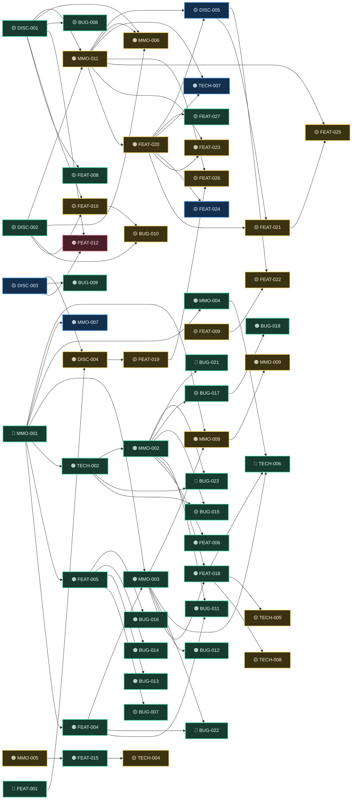
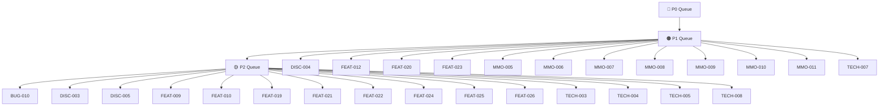

# Feature Tracker

Canonical execution tracker for bugs, features, technical work, and MMO rollout tasks.

_Generated from docs/feature-tracker.yaml via tools/trackergen. Edit YAML, not this file._

## Action State Legend

- `🟨 todo`: not started
- `🟦 in-progress`: currently being implemented
- `🟥 blocked`: waiting on prerequisite/decision
- `🟩 done`: shipped/verified

## Active Tracker

| ID | Type | Priority | Action State | Area | Item | Next Action |
|---|---|---|---|---|---|---|
| BUG-001 | Bug | P0 | 🟩 done | Auth/Session | Refresh race + first-login churn | Depends on: DISC-002,FEAT-010. Behavior lifecycle toasts now announce start spend and completion gains; next pass should add explicit rest-specific stamina/recovery delta callouts in snapshot/queue/event cues |
| BUG-002 | Bug | P0 | 🟩 done | Stream | Stale-token stream reconnect/401 + duplicate reconnect pressure | Added stream endpoint candidate resolution/failover (`window.host`, optional `VITE_STREAM_ORIGIN`, localhost `:8080` fallback), richer close/error diagnostics, and player-safe footer realtime status (raw transport errors no longer surfaced directly) |
| BUG-003 | Bug | P0 | 🟩 done | Chat | Default channel creation race (`failed to ensure default channel`) | Keep idempotent insert behavior as baseline |
| BUG-004 | Bug | P1 | 🟩 done | Admin UX | Tabs/layout instability and heavy stats payload rendering issues | Frontend now gates auth-required polling/stream connections until bootstrap refresh/context load settles; keep watching telemetry for any residual stale-session startup noise |
| BUG-005 | Bug | P1 | 🟩 done | Admin Audit | Actor identity not clearly visible in audit entries | Monitor for recurrence after broader gameplay updates |
| BUG-006 | Bug | P0 | 🟩 done | Gameplay UI | Stats overhaul has no clear visual/context separation; attributes and derived stats still feel mixed in the UI | Revisit only if modal regression appears |
| BUG-007 | Bug | P2 | 🟩 done | Startup UX | Gameplay/chat tabs visible before character creation | Keep actor username + account id visible in every row |
| BUG-008 | Bug | P2 | 🟩 done | Queue UX | Frontend queue controls do not expose DISC-001 schedule modes (`once/repeat/repeat-until`) | Queue cards now surface item/unlock requirements alongside duration/stamina/group, market wait controls only appear for market-gated behaviors, and repeat sell loops now auto-complete when resources are exhausted instead of failing |
| BUG-009 | Bug | P1 | 🟩 done | Gameplay Integrity | Mutually exclusive behaviors can run concurrently (e.g., rest + exercise) | Gameplay/chat tabs now stay hidden until character context exists, so pre-onboarding sessions remain profile/onboarding-first by default |
| BUG-010 | Bug | P2 | 🟨 todo | Snapshot UX | Rest effects are not visibly reflected in UI feedback | Depends on: DISC-002,FEAT-010. Surface rest-driven stamina/recovery deltas clearly in snapshot/queue/event cues |
| BUG-011 | Bug | P1 | 🟩 done | Admin/Chat UX | Chat admin realm targeting uses free-text id input instead of constrained selector | Depends on: DISC-002,FEAT-010. Behavior lifecycle toasts now announce start spend and completion gains; next pass should add explicit rest-specific stamina/recovery delta callouts in snapshot/queue/event cues |
| BUG-012 | Bug | P1 | 🟩 done | Character Lifecycle | Character creation behaves like upsert/replace and can accidentally wipe active save intent | Added stream endpoint candidate resolution/failover (`window.host`, optional `VITE_STREAM_ORIGIN`, localhost `:8080` fallback), richer close/error diagnostics, and player-safe footer realtime status (raw transport errors no longer surfaced directly) |
| BUG-013 | Bug | P1 | 🟩 done | Character Session UX | Character switching in frontend oscillates/alternates context instead of stabilizing on selected character | Character switch now persists preferred character, forces full context reload, and stream snapshot use is restricted to live context to avoid cross-character tick bleed |
| BUG-014 | Bug | P1 | 🟩 done | Auth/Session UX | Logout/login does not fully clear frontend transient state | Session-change subscription now enforces full client-state reset on token/session clear (including refresh-failure paths), and login/logout/no-session boundaries all converge on the same reset flow |
| BUG-015 | Bug | P2 | 🟩 done | Chat Bootstrap | Global channel is not initialized as global across realms at startup/bootstrap | Added deterministic global-channel bootstrap on runtime startup across known realms and realm-create bootstrap now ensures/reenables per-realm `global` binding visibility semantics |
| BUG-016 | Bug | P1 | 🟩 done | Realm/Character Context | Frontend intermittently hits `realmId does not match authenticated character realm` on character switch/login transitions | Market/chat reads now pass selected `characterId` context consistently, eliminating stale realm-query mismatch from character-switch/login transitions |
| BUG-017 | Bug | P2 | 🟩 done | Admin/Chat UX | Channel key UX conflates selecting existing keys with entering a new key | Added explicit known-channel selector vs new-channel-key input modes in admin chat controls; watch for operator feedback on flow clarity |
| BUG-018 | Bug | P1 | 🟩 done | Admin UX | Admin panel rendered blank due to missing React hook import after channel-key UX refactor | Restored missing `useMemo` import in AdminModal and revalidated frontend diagnostics/tests |
| BUG-019 | Bug | P1 | 🟩 done | Admin/Chat Scope UX | Admin panel channel suggestions were coupled to character-scoped chat channel reads | Added admin-scoped channel listing endpoint and switched known-channel options to active admin channel bindings across realms (global no longer the only reliable option) |
| BUG-020 | Bug | P1 | 🟩 done | Admin/Chat UX | Chat Ops form fields and targeting context drifted when known channel keys existed in multiple realms | Known channel selection is now realm-bound (`channel + realm` binding), metadata hydration is tied to that binding, and operation actions (disable/flush/moderation/system message) execute against an explicit single operation realm |
| BUG-021 | Bug | P0 | 🟩 done | Admin/Chat Ops UX | Chat Ops was not functionally useful and workflows were conflated | Rebuilt Chat Ops into discrete workflows: Create Channel, Edit Channel, and Realm Membership (Add/Remove per realm), plus single-context moderation/system actions tied to explicit channel binding + operation realm |
| BUG-022 | Bug | P0 | 🟩 done | Realm UX/Persistence | No clear way to create new realms; realm selector and creation flow are fragmented; realm id assignment should be DB-incremental rather than admin-entered | Added explicit `POST /v1/admin/realms` create flow with DB-owned incremental realm identity reservation and unified Admin realm selector/create UX |
| BUG-023 | Bug | P0 | 🟩 done | Admin/Chat Domain Model UX | Channel configuration is still treated as binding-specific; editing/flushing by `channel:realm` is confusing and violates intended `Channel -> Realm` relationship | Chat metadata updates are synchronized per channel key across bindings; realm membership flows now use source channel key (not source binding), and admin channel listing can include inactive bindings so removing the last active binding does not orphan channel recovery |
| BUG-024 | Bug | P0 | 🟩 done | Stream/Realtime | World stream WebSocket intermittently fails with connection refused (`NS_ERROR_WEBSOCKET_CONNECTION_REFUSED`) in browser sessions | Added stream endpoint candidate resolution/failover (`window.host`, optional `VITE_STREAM_ORIGIN`, localhost `:8080` fallback), richer close/error diagnostics, and footer-visible endpoint/attempt/error operator context |
| BUG-025 | Bug | P1 | 🟩 done | Runtime/Shutdown | Server process can appear hung/noisy in terminal after DB reset/crash paths because teardown paths could outlive cancellation and DB interruption errors bubbled as fatal runtime output | World-loop and HTTP shutdown paths now use cancellation-aware bounded teardown, telemetry flush is timeout-bounded, known DB-reset SQLSTATE interruptions are treated as graceful runtime shutdown, and GORM logging defaults to non-color silent mode (`LIVED_GORM_LOG_LEVEL` to override) to avoid terminal-hostile output |
| BUG-026 | Bug | P1 | 🟩 done | Build/Test | Full suite failed to compile in gameplay tests after DAL model embedding changes (`BehaviorInstance` no longer exposes promoted `ID` in keyed literals) | Updated gameplay runtime tests to construct `dal.BehaviorInstance` with explicit embedded `BaseModel` IDs; full `go test ./...` passes |
| BUG-027 | Bug | P2 | 🟩 done | Build/Module Hygiene | `go.mod` listed `github.com/jackc/pgx/v5` as indirect despite direct code imports (`pgconn`) | Promoted `github.com/jackc/pgx/v5` to direct dependency in root `require` block so diagnostics/tooling align with actual imports |
| FEAT-001 | Feature | P0 | 🟩 done | Core Gameplay | Split trainable character attributes from derived/running stats | Added financial as a first-class trainable attribute with derived trading aptitude (`social + financial`) and new training behaviors (`Study Ledger Math`, `Take Finance Class`) to support upcoming soft-gated market progression |
| FEAT-002 | Feature | P0 | 🟩 done | Core Gameplay | Add explicit stat formulas/docs (endurance -> stamina cap/recovery) in API docs | Keep formulas in sync with gameplay constants on future balance changes |
| FEAT-003 | Feature | P1 | 🟩 done | Chat | Channel subject support | Keep subject length/usage guidance aligned across admin form, API docs, and chat UI |
| FEAT-004 | Feature | P1 | 🟩 done | Realms | Realm naming + selector UX | Added persisted realm metadata (`name`, `whitelistOnly`) with admin editing, surfaced realm names across profile/onboarding/admin selectors, and removed raw-id-only realm labeling in primary UX paths |
| FEAT-005 | Feature | P1 | 🟩 done | Startup UX | First-load sequencing hardening | Completed bootstrap sequencing guardrails: startup boot screen suppresses transient auth flicker, gameplay/chat remain gated until character context is ready, and session-boundary resets keep startup state deterministic |
| FEAT-017 | Feature | P2 | 🟩 done | Realms/Auth | Whitelisted realm character creation access control | Added realm whitelist policy + per-account grant/revoke admin controls and enforced onboarding create checks so restricted realms require explicit admin approval |
| FEAT-006 | Feature | P1 | 🟩 done | Admin UX | Per-tab admin load diagnostics + retries | Added tab-scoped data health indicators, segment-level failure reporting, and targeted retry controls in AdminModal (top chrome + tab-local panel body status) |
| FEAT-007 | Feature | P2 | 🟩 done | Queue UX | Human-readable queue timing | Keep queue split between current work and recent results; revisit if users want richer timeline cues |
| FEAT-008 | Feature | P2 | 🟩 done | Progression | Restore progression panel for locked/future actions | Progression tab restored with locked/future behaviors, consumed single-use entries, and upgrade cards with explicit gate type labels; future pass can add richer graph-style dependency visualization |
| FEAT-009 | Feature | P2 | 🟨 todo | Time UX | Day/night indicator in snapshot | Night-only behaviors are now supported in runtime/catalog (`requiresNight`) with queue wait reasons; next pass should add a compact snapshot day/night indicator plus market/night session cues |
| FEAT-010 | Feature | P2 | 🟨 todo | Economy UX | Rolling production metrics (coins/min, wood/min) | Depends on: DISC-001, DISC-002. Add sampled rate cards after scheduling/rest loops are finalized |
| FEAT-011 | Feature | P1 | 🟩 done | Snapshot UX | Represent queued/active behaviors visually in player snapshot with compact progress bars | Keep baseline skyline bars stable; FEAT-012 polish remains blocked on DISC-001 and DISC-003 |
| FEAT-012 | Feature | P1 | 🟥 blocked | Snapshot UX | Persistent per-slot behavior skyline: show all available behavior slots, retain slot history state after completion, and visualize active progress against DISC-003 parallel limits (animation polish included) | Depends on: DISC-001,DISC-003. Expand prototype to slot-based persistent bars and upgrade-aware capacity, then polish transitions |
| FEAT-013 | Feature | P2 | 🟩 done | Queue UX | Add live per-row progress bars in Current Queue table | Keep compact bar readable as row counts increase |
| FEAT-014 | Feature | P2 | 🟩 done | Market UX | Improve market open/close countdown display (hours until 60m, then minutes) | Revisit only if players request day-aware market countdown phrasing |
| FEAT-015 | Feature | P1 | 🟩 done | Admin Observability | Show average tick time vs desired tick time with frame-budget visualization in admin stats | Exposed tick timing aggregates in `/v1/admin/stats` (`avgTickMs`, `targetTickMs`, budget delta/ratio, runs/failures) and rendered a Tick Budget visualization card in Admin Dashboard |
| FEAT-016 | Feature | P1 | 🟩 done | Layout UX | Add fixed footer with always-visible operational context while central content scrolls between fixed header/footer | Implemented fixed shell chrome with header+snapshot and always-visible operational footer while center content scrolls across profile/gameplay/chat views |
| DISC-001 | Feature | P2 | 🟩 done | Scheduling | Continuous/repeat-until behavior modes | Queue/runtime contracts now include per-behavior mode restrictions via game-data (`scheduleModes`) with UI controls for `once/repeat/repeat-until` and validated `repeatUntil` semantics |
| DISC-002 | Feature | P2 | 🟩 done | Gameplay | Rest behavior with accelerated recovery | Added `player_rest` with deterministic accelerated stamina recovery on completion (capped by max stamina) and validated queue/runtime interaction |
| DISC-003 | Feature | P2 | 🟦 in-progress | Progression Systems | Composable upgrade/modifier system | Added separate upgrade `costScaling` + `outputScaling` formulas with projected next-level costs/outputs in API/UI, explicit `gateTypes` in game-data/catalog, queue slot progression wiring, server-side batch completion summaries with realized spend/gain payloads, and a dedicated `cancelled` behavior state; next pass should add dependency graph rendering and richer gate semantics beyond resource/unlock |
| DISC-004 | Feature | P1 | 🟨 todo | Progression Systems | Behavior evolution contract: replace-vs-tier coexistence for upgraded behaviors | Depends on: DISC-003,FEAT-001. Define per-behavior evolution mode (`replace` vs `coexist`) and migration/runtime resolution rules so upgrades can either supersede or stack by design |
| DISC-005 | Feature | P2 | 🟦 in-progress | Economy/Social Finance | Player-created indexes with incentive/revenue-sharing model (future) | Realm-local phase-1 orderbook now ships API-supplied candle/overview feeds, observability-first market tab layout, wider open-order ergonomics (no default horizontal scrolling), explicit liquidity/cap/pressure stats, and deterministic `npc_cycle` autonomous repricing beyond player-only input; next pass should add admin market controls (inject/remove liquidity, pause matching, shock events) and deeper lot/entry ergonomics |
| TECH-001 | Technical | P1 | 🟩 done | Build/Runtime | Confirm YAML source embedding/versioning is compile-time and not runtime file dependency | Added YAML -> Go codegen (`tools/contentgen`) producing both `pkg/gamedata/zz_generated_game_data.go` and typed runtime behavior maps in `src/gameplay/zz_generated_behavior_definitions.go`, enforced full-document YAML validation during generation, surfaced metadata via `/v1/system/version`, and wired `mage build/run/dev/test` to auto-generate so runtime has no filesystem YAML dependency |
| TECH-002 | Technical | P1 | 🟩 done | Chat/Realms | Clarify channel-to-realm binding model (`*` global, per-realm, multi-realm) | Finalized v1 model: channel bindings are `scope=realm` with stable `scopeKey=realm:{id}`, wordlist policy is `policyScope=global` with `policyScopeKey=global`, and multi-realm expansion is reserved behind future scope families using opaque `scopeKey` |
| TECH-003 | Technical | P2 | 🟨 todo | Build Guardrails | Prevent raw-string/backtick regressions in embedded spec/template literals | Add a lightweight compile/lint guard that fails when unescaped backticks are introduced inside embedded raw strings |
| TECH-004 | Technical | P2 | 🟨 todo | Dev Workflow | Mage-driven local dev terminal HUD for tick/frame budget + runtime health (without altering app stdout) | Design runner-side HUD that reads side-channel metrics/logs and keeps app stdout clean for deployment logging pipelines |
| TECH-006 | Technical | P0 | 🟩 done | API Integrity | Enforce server-side payload/domain validation hardening across all mutating endpoints | Completed strict mutating-endpoint JSON binding (`src/server/requestbind`), normalized conflict semantics for queue/ascension state gates (400 vs 409), added regression coverage, and published validation matrix in `docs/api-validation-matrix.md` |
| FEAT-018 | Feature | P1 | 🟩 done | Admin Process UX | Process-oriented admin command model (explicit create/edit/activate/deactivate/attach/detach flows) | Admin command semantics are now explicit across chat (`create`/`edit`/`attach`), realm metadata (`edit`), account role/status (`set_role`/`set_status`), and character moderation (`edit`), with UI labels migrated away from implicit upsert/set phrasing |
| FEAT-019 | Feature | P2 | 🟨 todo | Producer Progression | Lumbering progression branch into woodworking with larger tool requirements and strength interaction | Depends on: DISC-004. Define producer-track behavior set (gather, refine, craft), tool unlock tiers, and strength-scaled throughput/cost formulas with inventory requirements |
| FEAT-020 | Feature | P1 | 🟨 todo | Trading Mechanics | Advanced trading orders + protections (lot size 100, buy/sell limits, timed buys, stop-loss, circuit breaker) | Depends on: MMO-011. Define order lifecycle/expiry contracts and matching rules, enforce quantity granularity of 100, and implement per-symbol circuit-breaker pause windows without halting whole market |
| FEAT-021 | Feature | P2 | 🟨 todo | Career Paths | Trader/Speculator career path (financial-first progression track) | Depends on: FEAT-020,DISC-005. Define milestone behaviors/unlocks for trader identity (analysis, liquidity scouting, market execution discipline), with financial + social soft gates and explicit progression rewards. |
| FEAT-022 | Feature | P2 | 🟨 todo | Career Paths | Night Operator career path (risk/reward night economy track) | Depends on: FEAT-009,DISC-005. Expand approved night behaviors into a full progression branch (street wagering, dock salvage, after-hours trade loops), including unique unlock chain and balance guardrails. |
| FEAT-023 | Feature | P1 | 🟨 todo | Admin Market Controls | Realm admin controls for market intervention (inject/remove liquidity, pause matching, shock events) | Depends on: MMO-011,FEAT-020. Define safe operator commands, audit semantics, and bounded effect models so test/live realms can run deterministic market interventions. |
| FEAT-024 | Feature | P2 | 🟦 in-progress | Market UX | Market order-entry ergonomics pass (lot presets, expiry presets, clearer risk/fee previews) | Added lot-based quantity selector (`x100`) and live inventory/coin affordability hints in order entry; next pass should add explicit escrow/refund/fee impact preview copy before submit. |
| FEAT-025 | Feature | P2 | 🟨 todo | Career Paths | Market-maker / liquidity steward career path | Depends on: FEAT-021,MMO-011. Define progression from passive liquidity support to active spread management with role identity rewards and anti-grief guardrails. |
| FEAT-026 | Feature | P2 | 🟨 todo | Career Paths | Logistics / convoy merchant career path | Depends on: FEAT-019,MMO-011. Define gather-haul-sell loop tied to convoy windows, route risk, and inventory throughput bonuses. |
| TECH-007 | Technical | P1 | 🟦 in-progress | Economy Balance | Market influence tuning (player vs NPC impact budgeting) | Added adaptive directional impact budgeting in `applySingleMarketDelta` using liquidity depth plus active-participant/population estimates, plus storyteller-driven curve corrections (`storyteller_curve`) to prevent one-way drift while preserving swings; next pass should tune coefficients from live telemetry and add operator controls for storyteller aggressiveness. |
| FEAT-027 | Feature | P2 | 🟩 done | Market UX | Dedicated symbol-overview mode with candle window controls | Completed dedicated `Market Overview` gameplay tab with multi-symbol selectable line graph + sample points and configurable bucket/window controls; continue monitoring readability as symbol count grows. |
| TECH-008 | Technical | P2 | 🟨 todo | Tracker Hygiene | Backlog audit for previously approved but untracked career paths/features | Run a documentation reconciliation pass against prior design notes/chat decisions and add missing approved paths/features with dependencies and priorities in `docs/feature-tracker.yaml`. |
| TECH-005 | Technical | P2 | 🟨 todo | Admin Safety | Preflight/preview support for destructive admin operations | Design optional preflight endpoints + confirmation metadata so destructive actions can be previewed and audit-linked before commit |
| MMO-001 | Technical | P0 | 🟩 done | Realm Partitioning | Complete remaining runtime/API default realm scoping and remove legacy unscoped read paths | Keep new realm-scoped resolver coverage for system/feed/chat/mmo + market endpoints and realm-aware admin audit ticks stable; watch for regressions |
| MMO-002 | Feature | P1 | 🟩 done | Admin/Chat | Chat control-plane endpoints (channel lifecycle + participant moderation + word policy lifecycle) | Implemented `/v1/admin/chat/*` control-plane set with per-action admin audit trails and Swagger coverage; next follow-up is BUG-015 deterministic global-channel bootstrap semantics |
| MMO-003 | Feature | P1 | 🟩 done | Admin/Realms | Realm delete/archive semantics and maintenance broadcast/drain hooks | Completed realm lifecycle control-plane semantics: `realm_decommission`/`realm_recommission`/`realm_delete` are wired in backend + Swagger + admin UI, with maintenance broadcasts, behavior drain, session revoke on decommission, and safe delete guardrails (non-default realm, decommissioned first, no remaining characters) + immutable audit trail |
| MMO-004 | Feature | P1 | 🟩 done | Admin/Moderation | Bulk realm-scoped account role/status operations with bounded batch and dry-run | Added `/v1/admin/moderation/accounts/bulk` with realm-scoped active-account targeting, `set_status`/`set_role` commands, bounded `limit`, optional `accountIds`, dry-run preview summaries, per-account audit events on apply, and bulk summary audit for preview/apply; Swagger + web API client wired |
| MMO-005 | Technical | P1 | 🟨 todo | Observability | Finish OTel profile integration and broaden non-HTTP log correlation | Add profile signal path and structured correlation fields in worker logs |
| MMO-006 | Technical | P1 | 🟨 todo | Economy Integrity | Add anomaly alerting and operator visibility for inflation/deflation/outlier gains | Depends on: DISC-001, DISC-002, MMO-011. Define metrics and thresholds; wire alert surfaces after inventory-backed actor simulation contracts settle |
| MMO-007 | Feature | P1 | 🟦 in-progress | Stream/Realtime | Add authenticated stream resume model (`lastEventId` cursor or snapshot fallback) | Stream now prefers WebSocket subprotocol bearer auth (`lived.v1, bearer.<token>`) and query-token fallback is config-gated with disabled-by-default policy; next step is finalizing reconnect SLO semantics and operator runbook targets. |
| MMO-008 | Technical | P1 | 🟨 todo | Lifecycle Ops | Provide admin-only realm snapshot import/export replacement for disabled player flows | Depends on: MMO-001, MMO-003. Define scoped endpoints, auth policy, and runbook |
| MMO-009 | Technical | P1 | 🟨 todo | Reliability/SRE | Establish MMO SLOs and backup/restore validation runbook | Depends on: MMO-008. Add documented SLO targets, DB pool baseline/tuning defaults, load-focused regression checks (stream/chat/queue pressure), and scheduled restore tests |
| MMO-010 | Technical | P1 | 🟨 todo | Security/Auth | Add JWT signing key rotation with active+next key (`kid`) handling | Add key metadata model and rotation operational flow; include access-token transport hardening policy (phase down query-token fallback after stream auth hardening) |
| MMO-011 | Technical | P1 | 🟨 todo | Economy Simulation | Inventory-backed market model + NPC actor participation (named + ephemeral) for natural supply/demand movement | Depends on: DISC-001,DISC-002. Add explicit market inventory state and NPC decision loops (buy/sell/hold) so price movement emerges from actor behavior rather than arbitrary mutation |

## Dependency Index (Iterable)

Use comma-separated IDs in `Depends On` for machine-parsable dependency traversal.

| ID | Depends On | Why this dependency exists |
|---|---|---|
| FEAT-004 | MMO-001 | Realm naming/selector should align with finalized realm scoping defaults |
| FEAT-005 | MMO-001 | Startup UX sequencing should not mask unresolved realm-scoping boot behavior |
| FEAT-006 | MMO-002 | Per-tab diagnostics should target the final admin control-plane tab behaviors |
| FEAT-008 | DISC-001 | Progression panel lock states depend on finalized behavior mode contracts |
| FEAT-010 | DISC-001,DISC-002 | Rolling rates depend on final scheduling cadence and rest-loop behavior |
| FEAT-012 | DISC-001,DISC-003 | Persistent slot skyline depends on finalized behavior modes and modifier-driven parallel capacity |
| FEAT-015 | MMO-005 | Tick budget UX should consume finalized observability metrics/contracts |
| FEAT-018 | MMO-002,MMO-003 | Process-oriented command contracts should align with finalized chat/realm control-plane lifecycle semantics |
| FEAT-019 | DISC-004 | Producer-track behavior unlock/replacement rules should follow finalized evolution semantics |
| FEAT-020 | MMO-011 | Advanced order mechanics need inventory-backed market simulation and actor-driven price movement first |
| FEAT-021 | FEAT-020,DISC-005 | Trader identity progression should build on mature order mechanics and finance/economy systems |
| FEAT-022 | FEAT-009,DISC-005 | Night-operator path relies on explicit day/night UX context and stabilized market-economy loops |
| FEAT-023 | MMO-011,FEAT-020 | Admin interventions must target the finalized actor-driven market and order lifecycle contracts |
| FEAT-024 | FEAT-020 | UX safety improvements should align with finalized advanced order model and protections |
| FEAT-025 | FEAT-021,MMO-011 | Liquidity-provider progression should align with trader track identity and actor-driven inventory simulation |
| FEAT-026 | FEAT-019,MMO-011 | Convoy/logistics path should sit on top of producer progression and market inventory simulation |
| TECH-007 | MMO-011,FEAT-020 | Impact balancing must use finalized actor-driven market depth and order lifecycle mechanics |
| FEAT-027 | FEAT-020 | Dedicated market-view UX should align with finalized order model and observability contracts |
| TECH-008 | FEAT-018 | Tracker hygiene should follow the canonical process-oriented planning workflow |
| BUG-007 | FEAT-005 | Startup tab gating should align with onboarding/boot sequencing contract |
| BUG-008 | DISC-001 | Queue UI mode controls must match finalized scheduling contract |
| BUG-009 | DISC-003 | Mutual exclusion and parallel-capacity rules should land together for coherent behavior scheduling |
| BUG-010 | DISC-002,FEAT-010 | Rest visibility relies on rest-loop behavior and rate/feedback surfaces |
| BUG-011 | FEAT-004,MMO-002 | Realm selector UX should align with realm identity and admin chat control-plane targeting contracts |
| BUG-012 | MMO-003 | Character replacement safeguards should align with lifecycle semantics and destructive-operation policy |
| BUG-013 | FEAT-005 | Character switch stability should follow startup/session context sequencing and single-character active context rules |
| BUG-014 | FEAT-005 | Logout/login boundaries must reset all UI state under the same startup/session sequencing contract |
| BUG-015 | TECH-002,MMO-002 | Global channel bootstrap must align with finalized channel binding and chat control-plane behavior |
| BUG-016 | FEAT-005 | Realm/character context reads should remain synchronized across login/refresh/switch transitions |
| BUG-017 | MMO-002 | Admin chat channel operations need clear existing-vs-new key input contracts |
| BUG-018 | BUG-017 | Regression introduced during channel-key UX refactor; keep regression checks with admin chat panel changes |
| BUG-021 | MMO-002 | Clear remove-channel-from-realm behavior and reliable Chat Ops display updates depend on finalized chat control-plane lifecycle semantics |
| BUG-022 | FEAT-004,MMO-003 | Unified realm selector/create UX and incremental realm-id generation should align with realm identity and lifecycle semantics |
| BUG-023 | TECH-002,MMO-002 | Channel-global configuration and realm-binding separation should align with finalized chat binding/control-plane contracts |
| TECH-004 | FEAT-015 | Local HUD should reuse tick budget metrics surfaced for admin observability |
| TECH-005 | FEAT-018 | Destructive-operation preflight/preview should follow finalized process-oriented command contracts |
| TECH-006 | FEAT-018,MMO-003,MMO-004 | Validation hardening should cover process-style admin command payloads and new realm/moderation control-plane surfaces |
| TECH-002 | MMO-001 | Channel/realm binding model must follow finalized realm scoping boundaries |
| MMO-002 | TECH-002 | Chat control-plane endpoint shape depends on binding-model decisions |
| MMO-003 | MMO-001,FEAT-004 | Realm lifecycle semantics rely on scoped runtime behavior and realm identity model |
| MMO-004 | MMO-001 | Bulk moderation must be safely realm-scoped first |
| MMO-006 | DISC-001,DISC-002,MMO-011 | Economy anomaly baselines should be computed after inventory-backed market actor simulation is finalized |
| MMO-007 | MMO-001 | Resume cursors/snapshots must be realm-scoped and deterministic |
| MMO-008 | MMO-001,MMO-003 | Snapshot import/export needs scoped realm boundaries and lifecycle semantics |
| MMO-009 | MMO-008 | Backup/restore runbooks depend on snapshot export/import mechanics |
| MMO-011 | DISC-001,DISC-002 | NPC/market inventory loops should align with finalized scheduling cadence and recovery/economy behavior rules |
| DISC-004 | DISC-003,FEAT-001 | Upgrade replacement-vs-coexistence rules should align with modifier architecture and existing behavior catalog contracts |
| DISC-005 | FEAT-020,MMO-011 | Social-finance index mechanics depend on mature order system and actor-driven inventory-backed market model |

## Dependency Flow

## Priority Flow

## Recently Completed

- Added storyteller-driven market curve management (`storyteller_curve`) and adaptive per-symbol directional impact budgets based on liquidity depth plus active realm participation/population baselines.
- Replaced in-tab all-symbol toggle with dedicated `Market Overview` tab featuring multi-symbol line graph trends with sample points and selectable history windows.
- Improved order entry ergonomics with lot-based quantity selection (`x100`) and live holdings/affordability hints (resource lots + coin escrow capacity).
- Added toast-first notifications and removed old inline app notices.
- Hardened admin modal loading/refresh behavior and stabilized tab layout.
- Added audit visual summaries and aggregate/fallback source labeling.
- Promoted gameplay stats into first-class Overview displays.
- Split trainable vs derived stat model and exposed `coreStats`/`derivedStats`.
- Added behavior catalog display metadata (`name`/`label`/`summary`) and wired gameplay UI to use it consistently.
- Completed TECH-006 API integrity pass: strict mutating-endpoint JSON binding, queue/ascension conflict-status normalization, and validation matrix publication.
- Began MMO-007 stream hardening pass: added strict origin enforcement, config-gated stream query-token fallback, and cursor-aware world stream resume metadata (`eventId` + `lastEventId` snapshot fallback).
- Continued MMO-007 auth transport hardening: stream clients now send access token via WebSocket subprotocol bearer (`lived.v1, bearer.<token>`), server parses subprotocol bearer credentials, and query-token fallback defaults to disabled unless explicitly enabled.

## Next Batch Queue (Priority Pass)

1. `MMO-007`: `MMO-007` (P1): Stream hardening + authenticated resume model (`lastEventId` cursor or snapshot fallback) with realm-scoped guarantees.
2. `MMO-005`: `MMO-005` (P1): OTel profile signal integration + non-HTTP structured log correlation fields for workers/loop operations.
3. `MMO-011`: `MMO-011` (P1): Inventory-backed market simulation and NPC actor loops to establish natural price movement baseline.
4. `FEAT-020`: `FEAT-020` (P1): Advanced trading order mechanics (lot-size constraints, limits, timed orders, stop-loss, circuit-breaker behavior) on top of MMO-011.
5. `FEAT-023`: `FEAT-023` (P1): Admin market intervention controls (liquidity ops, matching pauses, shock events) with bounded effects and audit trail.
6. `TECH-007`: `TECH-007` (P1): Market influence balancing (player vs NPC impact budgets, liquidity-aware repricing controls, and MMO fairness tuning).
7. `FEAT-027`: `FEAT-027` (P2): DONE - Dedicated Market Overview tab with multi-symbol sampled trend lines and configurable window controls.
8. `MMO-010`: `MMO-010` (P1): JWT signing key rotation with active+next key (`kid`) handling and access-token transport hardening policy.

## Sanity Scan Cross-Reference (2026-03-05)

| Sanity Scan Finding | Tracker Mapping | Coalesced Status |
|---|---|---|
| Character/default context ambiguity when `characterId` omitted | `BUG-012` | Absorbed into `BUG-012` next action scope |
| Stream origin permissiveness + query-token exposure | `MMO-007`, `MMO-010` | Absorbed into stream/auth hardening language |
| Need load + ops reliability baselines under multiplayer pressure | `MMO-009` | Absorbed into `MMO-009` next action scope |
| Non-HTTP worker/loop correlation and observability maturity | `MMO-005` | Already captured in existing task scope |
| Snapshot/read amplification and actor-driven economy pressure planning | `MMO-011`, `MMO-006` | Already represented by economy-simulation + anomaly tasks |

Unmapped findings intentionally left for follow-up review before adding new IDs:

- shared server helper consolidation to reduce duplicated handler helpers (`respondSuccess`, actor/realm resolution, parse helpers)
- frontend architecture refactor (`App.tsx`/`AdminModal.tsx`/`api.ts`) and over-fetch strategy consolidation
- explicit uniqueness constraints for domain-singular rows
- legacy-path classification pass (`runTickAt`, legacy frontend reference, legacy world behavior marker).

## Notes

- This is the only active feature tracker.
- MMO strategy and implementation guidance live in `.github` instruction files.
- Pre-alpha policy remains active: breaking changes are acceptable when they simplify architecture.
- Keep watching for embedded raw-string/backtick regressions (especially OpenAPI/template literals) during doc/spec edits.

## Documentation Canon

- Live execution state (`todo`/`in-progress`/`blocked`/`done`) belongs only in this file.
- Point-in-time analysis and design snapshots are reference-only:
	- `docs/admin-and-operations.md`
	- `docs/game-design.md`
	- `docs/mmo-migration-plan.md`
- When a reference doc includes actionable findings, absorb them into existing tracker IDs first; add new IDs only if no current scope fits.
