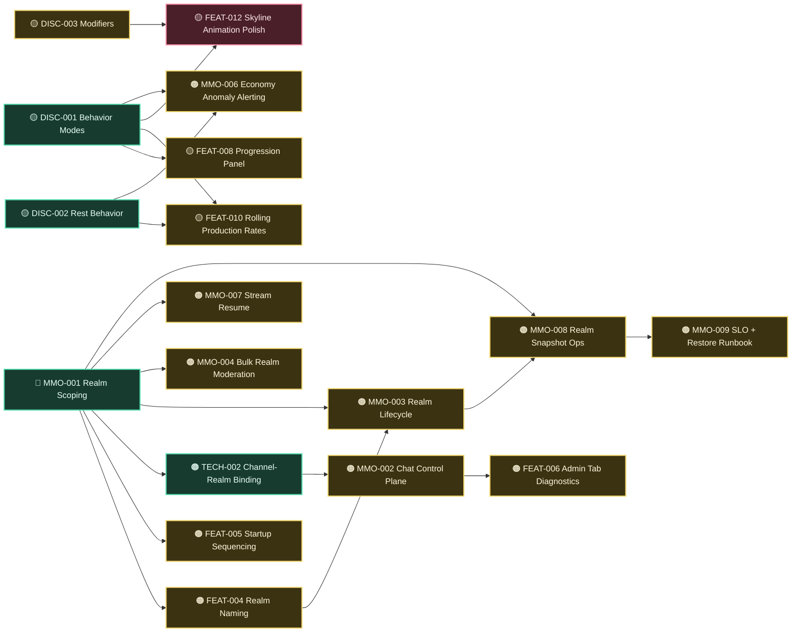

# Feature Tracker

Canonical execution tracker for bugs, features, technical work, and MMO rollout tasks.

## Action State Legend

- `🟨 todo`: not started
- `🟦 in-progress`: currently being implemented
- `🟥 blocked`: waiting on prerequisite/decision
- `🟩 done`: shipped/verified

## Visual Legend

- **Status colors/icons**: `🟩 done`, `🟦 in-progress`, `🟨 todo`, `🟥 blocked`
- **Priority icons (Mermaid nodes)**: `🔴 P0`, `🟠 P1`, `🟡 P2`

## Active Tracker

| ID | Type | Priority | Action State | Area | Item | Next Action |
|---|---|---|---|---|---|---|
| BUG-001 | Bug | P0 | 🟩 done | Auth/Session | Refresh race + first-login churn | Keep watching error telemetry during normal play sessions |
| BUG-002 | Bug | P0 | 🟩 done | Stream | Stale-token stream reconnect/401 + duplicate reconnect pressure | Monitor for recurrence after broader gameplay updates |
| BUG-003 | Bug | P0 | 🟩 done | Chat | Default channel creation race (`failed to ensure default channel`) | Keep idempotent insert behavior as baseline |
| BUG-004 | Bug | P1 | 🟩 done | Admin UX | Tabs/layout instability and heavy stats payload rendering issues | Revisit only if modal regression appears |
| BUG-005 | Bug | P1 | 🟩 done | Admin Audit | Actor identity not clearly visible in audit entries | Keep actor username + account id visible in every row |
| BUG-006 | Bug | P0 | 🟩 done | Gameplay UI | Stats overhaul has no clear visual/context separation; attributes and derived stats still feel mixed in the UI | Keep formula/context hints aligned with gameplay tuning updates |
| BUG-007 | Bug | P2 | 🟨 todo | Startup UX | Gameplay/chat tabs visible before character creation | Depends on: FEAT-005. Gate gameplay/chat tabs until `hasPrimaryPlayer` (or equivalent) is true and keep onboarding/new-character flow primary |
| BUG-008 | Bug | P2 | 🟨 todo | Queue UX | Frontend queue controls do not expose DISC-001 schedule modes (`once/repeat/repeat-until`) | Depends on: DISC-001. Add mode + repeat-until inputs to queue UX and reflect resolved schedule metadata in queue/history rows |
| BUG-009 | Bug | P1 | 🟩 done | Gameplay Integrity | Mutually exclusive behaviors can run concurrently (e.g., rest + exercise) | Queue-time + activation-time exclusion checks are enforced and queue UI now surfaces exclusivity block reasons for conflicting active behaviors |
| BUG-010 | Bug | P2 | 🟨 todo | Snapshot UX | Rest effects are not visibly reflected in UI feedback | Depends on: DISC-002,FEAT-010. Surface rest-driven stamina/recovery deltas clearly in snapshot/queue/event cues |
| BUG-011 | Bug | P1 | 🟩 done | Admin/Chat UX | Chat admin realm targeting uses free-text id input instead of constrained selector | Realm target selector (`*`/single/list) and per-realm fan-out result drilldown (including failure reasons) are implemented for chat admin actions |
| BUG-012 | Bug | P2 | 🟨 todo | Character Lifecycle | Character creation behaves like upsert/replace and can accidentally wipe active save intent | Depends on: MMO-003. Split create vs switch semantics and add explicit guardrails/confirmation before destructive replacement |
| BUG-013 | Bug | P1 | 🟩 done | Character Session UX | Character switching in frontend oscillates/alternates context instead of stabilizing on selected character | Character switch now persists preferred character, forces full context reload, and stream snapshot use is restricted to live context to avoid cross-character tick bleed |
| BUG-014 | Bug | P1 | 🟩 done | Auth/Session UX | Logout/login does not fully clear frontend transient state | Session-change subscription now enforces full client-state reset on token/session clear (including refresh-failure paths), and login/logout/no-session boundaries all converge on the same reset flow |
| BUG-015 | Bug | P2 | 🟨 todo | Chat Bootstrap | Global channel is not initialized as global across realms at startup/bootstrap | Depends on: TECH-002,MMO-002. Add deterministic bootstrap to ensure global channel presence/visibility semantics across all realms |
| BUG-016 | Bug | P1 | 🟩 done | Realm/Character Context | Frontend intermittently hits `realmId does not match authenticated character realm` on character switch/login transitions | Market/chat reads now pass selected `characterId` context consistently, eliminating stale realm-query mismatch from character-switch/login transitions |
| BUG-017 | Bug | P2 | 🟩 done | Admin/Chat UX | Channel key UX conflates selecting existing keys with entering a new key | Added explicit known-channel selector vs new-channel-key input modes in admin chat controls; watch for operator feedback on flow clarity |
| BUG-018 | Bug | P1 | 🟩 done | Admin UX | Admin panel rendered blank due to missing React hook import after channel-key UX refactor | Restored missing `useMemo` import in AdminModal and revalidated frontend diagnostics/tests |
| BUG-019 | Bug | P1 | 🟩 done | Admin/Chat Scope UX | Admin panel channel suggestions were coupled to character-scoped chat channel reads | Added admin-scoped channel listing endpoint and switched known-channel options to active admin channel bindings across realms (global no longer the only reliable option) |
| BUG-020 | Bug | P1 | 🟩 done | Admin/Chat UX | Chat Ops form fields and targeting context drifted when known channel keys existed in multiple realms | Known channel selection is now realm-bound (`channel + realm` binding), metadata hydration is tied to that binding, and operation actions (disable/flush/moderation/system message) execute against an explicit single operation realm |
| BUG-021 | Bug | P0 | 🟨 todo | Admin/Chat Ops UX | Chat Ops display state still does not update reliably and there is no clear remove-channel-from-realm workflow | Do not implement yet. Define explicit remove-from-realm action contract (UI + endpoint semantics), then update Chat Ops state refresh flow and add regression coverage |
| BUG-022 | Bug | P0 | 🟨 todo | Realm UX/Persistence | No clear way to create new realms; realm selector and creation flow are fragmented; realm id assignment should be DB-incremental rather than admin-entered | Do not implement yet. Design unified realm selector/create UX and move realm id creation to DB-generated incremental ids, then align API/admin handlers |
| FEAT-001 | Feature | P0 | 🟩 done | Core Gameplay | Split trainable character attributes from derived/running stats | Keep catalog `name`/`label`/`summary` metadata aligned with behavior design updates |
| FEAT-002 | Feature | P0 | 🟩 done | Core Gameplay | Add explicit stat formulas/docs (endurance -> stamina cap/recovery) in API docs | Keep formulas in sync with gameplay constants on future balance changes |
| FEAT-003 | Feature | P1 | 🟩 done | Chat | Channel subject support | Keep subject length/usage guidance aligned across admin form, API docs, and chat UI |
| FEAT-004 | Feature | P1 | 🟩 done | Realms | Realm naming + selector UX | Added persisted realm metadata (`name`, `whitelistOnly`) with admin editing, surfaced realm names across profile/onboarding/admin selectors, and removed raw-id-only realm labeling in primary UX paths |
| FEAT-005 | Feature | P1 | 🟩 done | Startup UX | First-load sequencing hardening | Completed bootstrap sequencing guardrails: startup boot screen suppresses transient auth flicker, gameplay/chat remain gated until character context is ready, and session-boundary resets keep startup state deterministic |
| FEAT-017 | Feature | P2 | 🟩 done | Realms/Auth | Whitelisted realm character creation access control | Added realm whitelist policy + per-account grant/revoke admin controls and enforced onboarding create checks so restricted realms require explicit admin approval |
| FEAT-006 | Feature | P1 | 🟨 todo | Admin UX | Per-tab admin load diagnostics + retries | Depends on: MMO-002. Add tab-level load state indicators after control-plane endpoints settle |
| FEAT-007 | Feature | P2 | 🟩 done | Queue UX | Human-readable queue timing | Keep queue split between current work and recent results; revisit if users want richer timeline cues |
| FEAT-008 | Feature | P2 | 🟨 todo | Progression | Restore progression panel for locked/future actions | Depends on: DISC-001. Keep queue dropdown limited to queueable actions while progression reflects finalized behavior modes |
| FEAT-009 | Feature | P2 | 🟨 todo | Time UX | Day/night indicator in snapshot | Add compact visual in snapshot panel |
| FEAT-010 | Feature | P2 | 🟨 todo | Economy UX | Rolling production metrics (coins/min, wood/min) | Depends on: DISC-001, DISC-002. Add sampled rate cards after scheduling/rest loops are finalized |
| FEAT-011 | Feature | P1 | 🟩 done | Snapshot UX | Represent queued/active behaviors visually in player snapshot with compact progress bars | Keep baseline skyline bars stable; FEAT-012 polish remains blocked on DISC-001 and DISC-003 |
| FEAT-012 | Feature | P1 | 🟥 blocked | Snapshot UX | Persistent per-slot behavior skyline: show all available behavior slots, retain slot history state after completion, and visualize active progress against DISC-003 parallel limits (animation polish included) | Depends on: DISC-001,DISC-003. Expand prototype to slot-based persistent bars and upgrade-aware capacity, then polish transitions |
| FEAT-013 | Feature | P2 | 🟩 done | Queue UX | Add live per-row progress bars in Current Queue table | Keep compact bar readable as row counts increase |
| FEAT-014 | Feature | P2 | 🟩 done | Market UX | Improve market open/close countdown display (hours until 60m, then minutes) | Revisit only if players request day-aware market countdown phrasing |
| FEAT-015 | Feature | P1 | 🟨 todo | Admin Observability | Show average tick time vs desired tick time with frame-budget visualization in admin stats | Depends on: MMO-005. Expose tick timing aggregates and render clear under/over-budget indicators in admin UX |
| FEAT-016 | Feature | P1 | 🟨 todo | Layout UX | Add fixed footer with always-visible operational context while central content scrolls between fixed header/footer | Implement viewport layout with fixed chrome and scrollable center pane across main app views |
| DISC-001 | Feature | P2 | 🟩 done | Scheduling | Continuous/repeat-until behavior modes | Finalized behavior mode contracts (`once/repeat/repeat-until`) in queue/runtime API with validated request rules (`repeatUntil` only for `repeat-until`) and deterministic rescheduling semantics |
| DISC-002 | Feature | P2 | 🟩 done | Gameplay | Rest behavior with accelerated recovery | Added `player_rest` with deterministic accelerated stamina recovery on completion (capped by max stamina) and validated queue/runtime interaction |
| DISC-003 | Feature | P2 | 🟨 todo | Progression Systems | Composable upgrade/modifier system | Prototype upgrade that raises max parallel behaviors |
| TECH-001 | Technical | P1 | 🟨 todo | Build/Runtime | Confirm YAML source embedding/versioning is compile-time and not runtime file dependency | Verify embed pipeline and version metadata flow |
| TECH-002 | Technical | P1 | 🟩 done | Chat/Realms | Clarify channel-to-realm binding model (`*` global, per-realm, multi-realm) | Finalized v1 model: channel bindings are `scope=realm` with stable `scopeKey=realm:{id}`, wordlist policy is `policyScope=global` with `policyScopeKey=global`, and multi-realm expansion is reserved behind future scope families using opaque `scopeKey` |
| TECH-003 | Technical | P2 | 🟨 todo | Build Guardrails | Prevent raw-string/backtick regressions in embedded spec/template literals | Add a lightweight compile/lint guard that fails when unescaped backticks are introduced inside embedded raw strings |
| TECH-004 | Technical | P2 | 🟨 todo | Dev Workflow | Mage-driven local dev terminal HUD for tick/frame budget + runtime health (without altering app stdout) | Design runner-side HUD that reads side-channel metrics/logs and keeps app stdout clean for deployment logging pipelines |
| MMO-001 | Technical | P0 | 🟩 done | Realm Partitioning | Complete remaining runtime/API default realm scoping and remove legacy unscoped read paths | Keep new realm-scoped resolver coverage for system/feed/chat/mmo + market endpoints and realm-aware admin audit ticks stable; watch for regressions |
| MMO-002 | Feature | P1 | 🟨 todo | Admin/Chat | Chat control-plane endpoints (channel lifecycle + participant moderation + word policy lifecycle) | Depends on: TECH-002. Implement endpoint set and audit trails for each action |
| MMO-003 | Feature | P1 | 🟨 todo | Admin/Realms | Realm delete/archive semantics and maintenance broadcast/drain hooks | Depends on: MMO-001, FEAT-004. Define safe decommission flow and operator UX contracts |
| MMO-004 | Feature | P1 | 🟨 todo | Admin/Moderation | Bulk realm-scoped account role/status operations with bounded batch and dry-run | Depends on: MMO-001. Design API contract with preview and audit logging |
| MMO-005 | Technical | P1 | 🟨 todo | Observability | Finish OTel profile integration and broaden non-HTTP log correlation | Add profile signal path and structured correlation fields in worker logs |
| MMO-006 | Technical | P1 | 🟨 todo | Economy Integrity | Add anomaly alerting and operator visibility for inflation/deflation/outlier gains | Depends on: DISC-001, DISC-002. Define metrics and thresholds; wire alert surfaces after loop behavior contracts settle |
| MMO-007 | Feature | P1 | 🟨 todo | Stream/Realtime | Add authenticated stream resume model (`lastEventId` cursor or snapshot fallback) | Depends on: MMO-001. Define protocol and server reconnect behavior with realm-scoped cursor guarantees |
| MMO-008 | Technical | P1 | 🟨 todo | Lifecycle Ops | Provide admin-only realm snapshot import/export replacement for disabled player flows | Depends on: MMO-001, MMO-003. Define scoped endpoints, auth policy, and runbook |
| MMO-009 | Technical | P1 | 🟨 todo | Reliability/SRE | Establish MMO SLOs and backup/restore validation runbook | Depends on: MMO-008. Add documented SLO targets and scheduled restore tests |
| MMO-010 | Technical | P1 | 🟨 todo | Security/Auth | Add JWT signing key rotation with active+next key (`kid`) handling | Add key metadata model and rotation operational flow |

## Dependency Index (Iterable)

Use comma-separated IDs in `Depends On` for machine-parsable dependency traversal.

| ID | Depends On | Why this dependency exists |
|---|---|---|
| FEAT-004 | MMO-001 | Realm naming/selector should align with finalized realm scoping defaults |
| FEAT-005 | MMO-001 | Startup UX sequencing should not mask unresolved realm-scoping boot behavior |
| FEAT-006 | MMO-002 | Per-tab diagnostics should target the final admin control-plane tab behaviors |
| FEAT-008 | DISC-001 | Progression panel lock states depend on finalized behavior mode contracts |
| FEAT-010 | DISC-001,DISC-002 | Rolling rates depend on final scheduling cadence and rest-loop behavior |
| FEAT-012 | DISC-001,DISC-003 | Persistent slot skyline depends on finalized behavior modes and modifier-driven parallel capacity |
| FEAT-015 | MMO-005 | Tick budget UX should consume finalized observability metrics/contracts |
| BUG-007 | FEAT-005 | Startup tab gating should align with onboarding/boot sequencing contract |
| BUG-008 | DISC-001 | Queue UI mode controls must match finalized scheduling contract |
| BUG-009 | DISC-003 | Mutual exclusion and parallel-capacity rules should land together for coherent behavior scheduling |
| BUG-010 | DISC-002,FEAT-010 | Rest visibility relies on rest-loop behavior and rate/feedback surfaces |
| BUG-011 | FEAT-004,MMO-002 | Realm selector UX should align with realm identity and admin chat control-plane targeting contracts |
| BUG-012 | MMO-003 | Character replacement safeguards should align with lifecycle semantics and destructive-operation policy |
| BUG-013 | FEAT-005 | Character switch stability should follow startup/session context sequencing and single-character active context rules |
| BUG-014 | FEAT-005 | Logout/login boundaries must reset all UI state under the same startup/session sequencing contract |
| BUG-015 | TECH-002,MMO-002 | Global channel bootstrap must align with finalized channel binding and chat control-plane behavior |
| BUG-016 | FEAT-005 | Realm/character context reads should remain synchronized across login/refresh/switch transitions |
| BUG-017 | MMO-002 | Admin chat channel operations need clear existing-vs-new key input contracts |
| BUG-018 | BUG-017 | Regression introduced during channel-key UX refactor; keep regression checks with admin chat panel changes |
| BUG-021 | MMO-002 | Clear remove-channel-from-realm behavior and reliable Chat Ops display updates depend on finalized chat control-plane lifecycle semantics |
| BUG-022 | FEAT-004,MMO-003 | Unified realm selector/create UX and incremental realm-id generation should align with realm identity and lifecycle semantics |
| TECH-004 | FEAT-015 | Local HUD should reuse tick budget metrics surfaced for admin observability |
| TECH-002 | MMO-001 | Channel/realm binding model must follow finalized realm scoping boundaries |
| MMO-002 | TECH-002 | Chat control-plane endpoint shape depends on binding-model decisions |
| MMO-003 | MMO-001,FEAT-004 | Realm lifecycle semantics rely on scoped runtime behavior and realm identity model |
| MMO-004 | MMO-001 | Bulk moderation must be safely realm-scoped first |
| MMO-006 | DISC-001,DISC-002 | Economy anomaly baselines depend on finalized loop behavior design |
| MMO-007 | MMO-001 | Resume cursors/snapshots must be realm-scoped and deterministic |
| MMO-008 | MMO-001,MMO-003 | Snapshot import/export needs scoped realm boundaries and lifecycle semantics |
| MMO-009 | MMO-008 | Backup/restore runbooks depend on snapshot export/import mechanics |

## Dependency Flow

## Recently Completed

- Added toast-first notifications and removed old inline app notices.
- Hardened admin modal loading/refresh behavior and stabilized tab layout.
- Added audit visual summaries and aggregate/fallback source labeling.
- Promoted gameplay stats into first-class Overview displays.
- Split trainable vs derived stat model and exposed `coreStats`/`derivedStats`.
- Added behavior catalog display metadata (`name`/`label`/`summary`) and wired gameplay UI to use it consistently.

## Notes

- This is the only active feature tracker.
- MMO strategy and implementation guidance live in `.github` instruction files.
- Pre-alpha policy remains active: breaking changes are acceptable when they simplify architecture.
- Keep watching for embedded raw-string/backtick regressions (especially OpenAPI/template literals) during doc/spec edits.